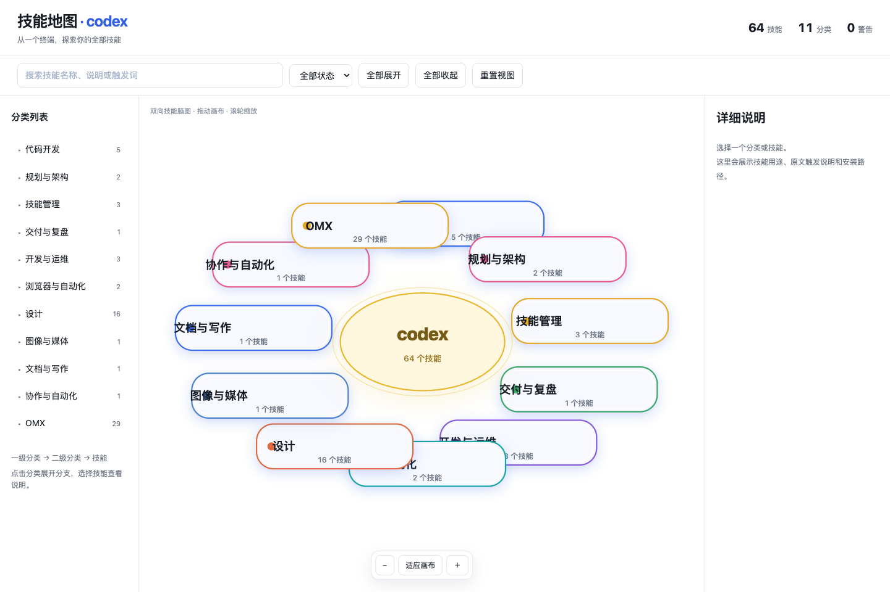

# Skill Atlas

> 把散落在本地终端里的 Skill，整理成一张真正看得懂、点得动的技能地图。

[](https://cc-kris.github.io/skill-atlas/output/skill-atlas.html)
[](#许可证)

Skill Atlas 会扫描你本机的 Codex、Claude Code、WorkBuddy、OpenCode 或自定义目录，把分散的 `SKILL.md` 整理成一张可搜索、可缩放、可点击的交互式技能地图。

你可以把它理解成“技能目录的可视化入口”：先按终端和类别定位，再点击单个 Skill 查看触发词、中文说明和来源路径。生成结果是一个自包含 HTML 文件，离线也能打开。

## 效果预览



在线体验：[打开交互式技能地图](https://cc-kris.github.io/skill-atlas/output/skill-atlas.html)

## 为什么使用它

- **一眼看全**：把几十甚至上百个 Skill 从文件夹变成可浏览的地图。
- **找到得更快**：支持关键词搜索、分类筛选、缩放、拖拽和点击查看详情。
- **说明更易懂**：可使用本机终端模型补充中文摘要和语义分类。
- **结果可带走**：HTML 自包含，不依赖外部 CDN，生成后可直接分享或归档。

## 3 步开始

```bash
# 1. 生成 Codex 技能地图
python3 skill-atlas/scripts/build_atlas.py \
  --host codex \
  --output output/skill-atlas.html

# 2. 在浏览器打开
open output/skill-atlas.html

# 3. 也可以切换到其他终端
python3 skill-atlas/scripts/build_atlas.py \
  --host claude-code \
  --output output/claude-skills.html
```

## 常用参数

| 参数 | 作用 |
| --- | --- |
| `--host` | `codex`、`claude-code`、`workbuddy`、`opencode` 或 `generic` |
| `--root PATH` | `generic` 模式下指定 Skill 根目录 |
| `--include-project` | 同时扫描当前项目的 `.agents/skills` |
| `--no-ai-label` | 不调用本机终端模型，只生成本地结构 |
| `--open` | 构建完成后尝试打开浏览器 |

## 安装为 Codex Skill

```bash
cp -R skill-atlas ~/.codex/skills/skill-atlas
```

重新打开 Codex 会话后即可使用。

## 支持的终端

| 终端 | 默认目录 | 中文总结调用 |
| --- | --- | --- |
| Codex | `~/.codex/skills` | `codex exec` |
| Claude Code | `~/.claude/skills` | `claude` |
| WorkBuddy | `~/.workbuddy/skills` | 按本地配置 |
| OpenCode | `~/.config/opencode/skills` | 按本地配置 |

## 隐私与边界

- 默认只读取本地 `SKILL.md`、可选 `skill.json` 和公开元数据。
- 不读取密钥、凭据、历史记录或缓存目录。
- 生成的 HTML/JSON 可能包含本机路径，公开分享前请确认。
- 触发词必须能在源文件中找到，不会凭空创造。
- AI CLI 生成按批次缓存；中断后再次运行会续传，不会用不完整结果覆盖现有 HTML。

Skill Atlas 扫描 Codex、Claude Code、WorkBuddy、OpenCode 或自定义目录中的 SKILL.md，整理名称、触发词、分类、中文说明和路径，生成可离线打开的交互式脑图。

## 预览

打开 [交互式技能地图](https://cc-kris.github.io/skill-atlas/output/skill-atlas.html)。这是可直接操作的网页，不是 GitHub 源码文件页。页面以当前终端为中心，分类向左右两侧展开；左侧可展开分类，中间可缩放、拖拽脑图，点击 Skill 查看触发词、中文说明和路径。

## 核心能力

| 能力 | 说明 |
| --- | --- |
| 终端识别 | 支持 Codex、Claude Code、WorkBuddy、OpenCode 和自定义目录 |
| 真实触发词 | 只从源 Skill 明确声明的 `trigger(s)`、触发词、适用场景或 `Use_When` 区块提取；命令、路径和代码示例不会被误当成触发词 |
| 层级分类 | 终端 → 一级分类 → 二级分类 → Skill |
| 左右脑图 | 以终端为中心向两侧扩散，分支预留间距避免堆叠 |
| 中文说明 | 使用安装所在终端的默认模型生成 |
| 离线交付 | HTML 自包含，不依赖外部 CDN |

## 项目结构

    skill-atlas/
    ├── SKILL.md              # 可安装的 Skill 入口
    ├── scripts/              # 扫描、提取、分类、总结、构建
    ├── adapters/             # 终端目录适配器
    ├── references/           # 配置和输出结构
    ├── assets/               # 内置脑图布局库
    └── tests/                # 测试与 fixture

## 开发验证

    python3 -m py_compile skill-atlas/scripts/*.py
    python3 -m unittest discover -s skill-atlas/tests -p 'test_*.py'

项目不要求额外 Python 第三方依赖。

## 许可证

本项目暂未指定开源许可证。二次分发前请联系维护者确认授权。
